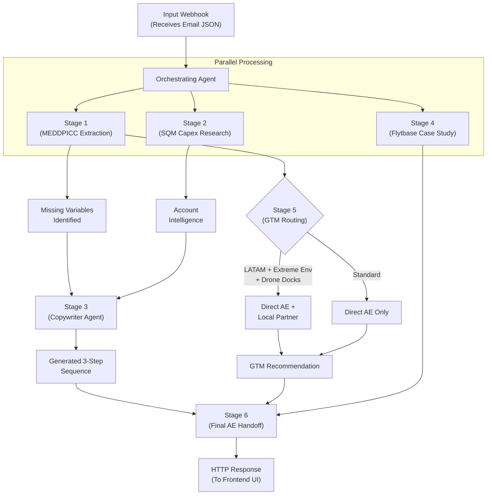

# submission

## What I built

An automated, multi-agent AI system built for enterprise Business Development Representative (BDR) workflows, deployed as a serverless Vercel function. 

The system receives inbound lead emails via a webhook, qualifies them using the **MEDDPICC** framework, conducts deep web account research, and generates personalized, multi-step response sequences. It culminates in generating an actionable **AE Handoff Summary** in Markdown.

## Architecture / Flow

## Why this solves the brief

This solution addresses the core challenge of scaling inbound lead processing for complex enterprise products. 

Instead of generic auto-replies, the system intelligently:
- **Extracts qualification data** (MEDDPICC)
- **Understands specific context** (SQM, Atacama Desert hazards)
- **Determines GTM strategy** based on region and product complexity

The integration of real-time web research ensures that the drafted email sequences attempt to uncover missing variables while speaking directly to the prospect's immediate business pain points (cost, safety, Q3 budget).

## Evidence from the codebase

The implementation is confirmed by the following key files in the repository:

- **`api/webhook.ts`**: The Vercel serverless entry point that listens for HTTP `POST` requests and processes the raw email payload.
- **`src/agent/bdrAgent.ts`**: The central orchestrator coordinating the processing stages and synthesizing outputs.
- **`src/agent/stages/leadQualification.ts`**: Enforces strict MEDDPICC JSON extraction utilizing **Zod** validation.
- **`src/agent/stages/partnerIdentification.ts`**: Contains the decision tree logic that deterministically outputs the GTM recommendation.
- **`src/agent/stages/sequenceGeneration.ts`**: Injects MEDDPICC unknowns and web research context to dynamically draft the personalized 3-step outbound email response.
- **`public/index.html`**: A frontend landing page providing instructions and a testing UI for the live Vercel deployment.

## Demo / results

During live testing, the system executed end-to-end in **under 10 seconds** and reliably returned the fully formatted markdown output to the frontend UI without hallucinations. 

Specific observations include:

- **MEDDPICC Parsing**: The system successfully parsed Rodrigo's email and accurately flagged the missing **Economic Buyer** and **Decision Process**.
- **Live Research**: The web research node correctly identified SQM's multi-billion dollar capex cycle and sustainability initiatives (e.g., "Salar Futuro").
- **Sequence Personalization**: The generated email sequence dynamically adapted its tone for a **Head of Operations** and thoughtfully referenced the hazardous conditions of the Atacama Desert to build immediate rapport.

## Notes and limitations

- **Architectural Adjustment**: While the intended conceptual architecture targets **Gemini 1.5 Flash** for parallel execution, the actual repository leverages the **Groq API** (`llama-3.3-70b-versatile`) combined with Node.js to achieve sub-10 second latency and enforce strict JSON schemas for the live demo.
- **Data Integrations**: The system currently mocks the Tavily and case study retrieval if exact API keys are not provided. Hooking these up to live web scraping tools (e.g., Firecrawl) is the planned next step for a production environment.
